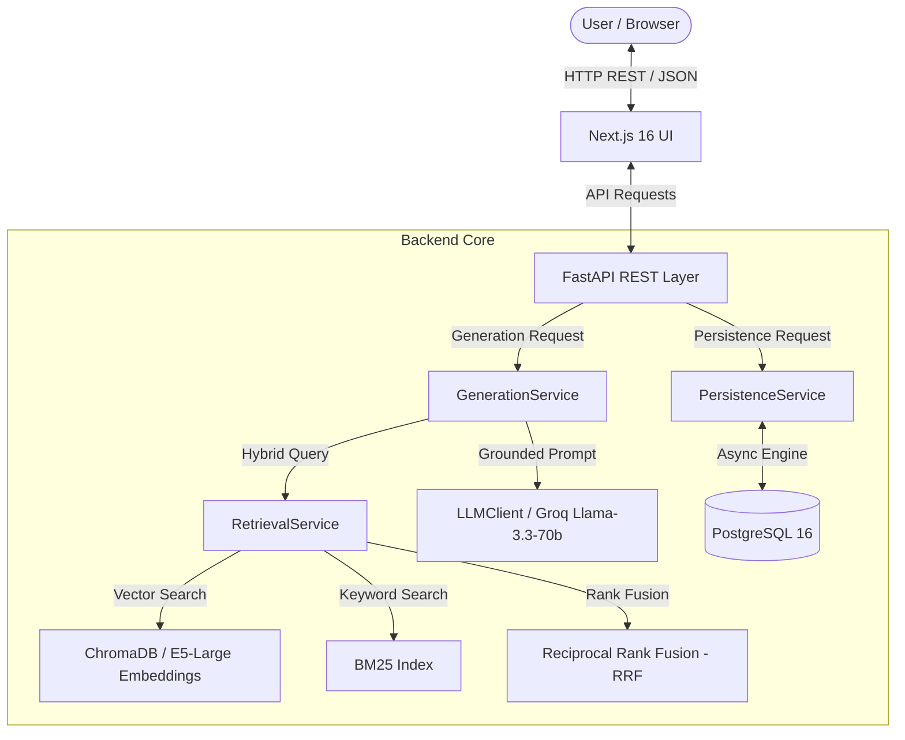
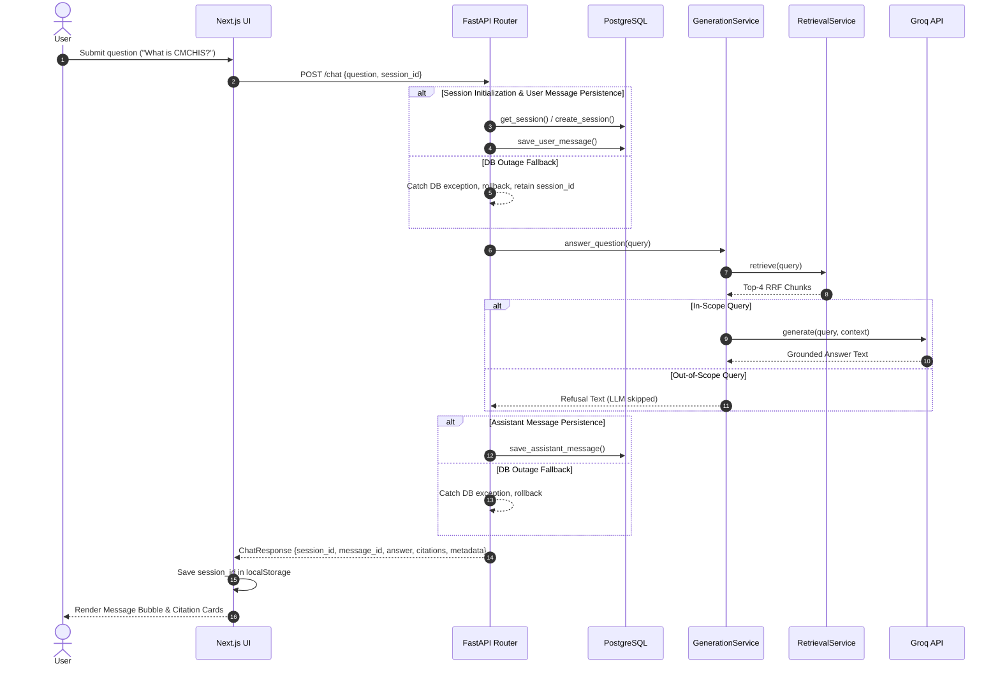

# System Architecture Documentation

## Overview

The Tamil Nadu Government AI Scheme Assistant is a production-grade, grounded Retrieval-Augmented Generation (RAG) system. It enables citizens to query official Tamil Nadu welfare scheme documents in English and Tamil with zero hallucinations, strict page-level citation tracing, and asynchronous session persistence.

---

## Component Breakdown

### 1. Data Ingestion Pipeline (`backend/ingestion/`)
- **PDF Extraction**: Extracts text per-page using `pypdf`.
- **Text Cleaning**: Normalizes NFKC Unicode (preserving Tamil script), strips control characters, collapses excessive whitespace, and removes repeated headers/footers.
- **Recursive Chunking**: Splits text into 1000-character chunks with 200-character overlap using `RecursiveCharacterTextSplitter`.
- **Deterministic Hashing**: Generates reproducible hex SHA-256 chunk IDs based on file hash, page number, and chunk index.

### 2. Hybrid Retrieval Engine (`backend/app/rag/`)
- **Dense Vector Search**: Generates 1024-dimensional embeddings via `intfloat/multilingual-e5-large` stored in a persistent ChromaDB instance (`hnsw:space: cosine`).
- **Sparse Keyword Search**: Maintains an in-memory BM25 index built over tokenized chunk texts.
- **Reciprocal Rank Fusion (RRF)**: Merges rank positions from vector search and BM25 search using constant $k=60$:
  $$RRF\_Score(d) = \sum_{m \in M} \frac{1}{k + r_m(d)}$$

### 3. Relevance Guard & Grounded Generation (`backend/app/services/generation_service.py`)
- Evaluates top candidate chunk scores against configured minimum score thresholds (`retrieval_min_score`, `retrieval_max_vector_distance`, `retrieval_min_bm25_score`).
- **Scope Guard**: Out-of-scope queries (e.g. general knowledge questions) bypass the LLM call entirely and return an instant refusal response with 0 citations.
- **Prompt Construction**: Injects retrieved chunk texts with metadata headers into system/user prompts.
- **LLM Abstraction**: Consumes `LLMClient` protocol (configured for `GroqClient` with `llama-3.3-70b-versatile` at `temperature=0`).

### 4. Conversation Persistence & Feedback Layer (`backend/app/services/persistence_service.py`)
- Manages PostgreSQL database entities (`chat_sessions`, `chat_messages`, `feedback`).
- Operates asynchronously with `AsyncSession` and `NullPool` for event-loop safety.
- **Non-Blocking Resilience**: Database write failures during chat execution are caught, logged, and rolled back without interrupting RAG answer delivery.

---

## Request Sequence Diagram

