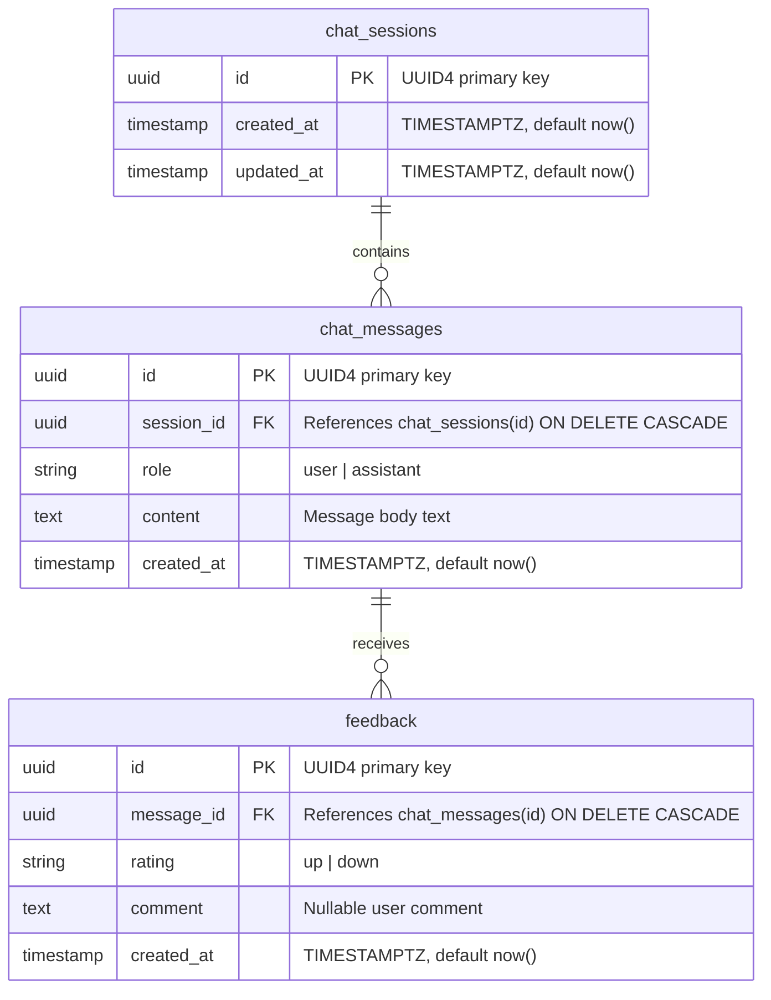

# Database Schema & Entity Relationship Documentation

## Database Engine
- **Database**: PostgreSQL 16 (running via `postgres:16-alpine` container)
- **ORM Framework**: Async SQLAlchemy 2.0 (`AsyncSession`, `AsyncEngine`)
- **Connection Driver**: `asyncpg`
- **Pool Management**: `NullPool` (ensures zero cross-loop connection leakage across async request contexts)

---

## Entity Relationship Diagram

---

## Table Specifications

### 1. `chat_sessions`
Represents an individual chat session grouping user questions and assistant responses.

| Column | Data Type | Constraints | Description |
| :--- | :--- | :--- | :--- |
| `id` | `UUID` | Primary Key, `default=uuid4` | Unique session identifier |
| `created_at` | `TIMESTAMPTZ` | Not Null, `server_default=now()` | Session creation timestamp |
| `updated_at` | `TIMESTAMPTZ` | Not Null, `server_default=now()` | Last message timestamp |

### 2. `chat_messages`
Stores user questions and assistant responses.

| Column | Data Type | Constraints | Description |
| :--- | :--- | :--- | :--- |
| `id` | `UUID` | Primary Key, `default=uuid4` | Unique message identifier |
| `session_id` | `UUID` | Foreign Key (`chat_sessions.id`), Not Null, Indexed | Parent session reference |
| `role` | `VARCHAR(20)` | Not Null | `"user"` or `"assistant"` |
| `content` | `TEXT` | Not Null | User question text or LLM answer |
| `created_at` | `TIMESTAMPTZ` | Not Null, `server_default=now()` | Message timestamp |

### 3. `feedback`
Stores user ratings and optional comments for assistant messages.

| Column | Data Type | Constraints | Description |
| :--- | :--- | :--- | :--- |
| `id` | `UUID` | Primary Key, `default=uuid4` | Unique feedback identifier |
| `message_id` | `UUID` | Foreign Key (`chat_messages.id`), Not Null, Indexed | Targeted assistant message |
| `rating` | `VARCHAR(10)` | Not Null | `"up"` or `"down"` |
| `comment` | `TEXT` | Nullable | Optional citizen comment |
| `created_at` | `TIMESTAMPTZ` | Not Null, `server_default=now()` | Submission timestamp |

---

## Data Isolation & Security Sanity

1. **No Embeddings in PostgreSQL**: Vector embeddings are kept exclusively inside ChromaDB.
2. **No Prompts in PostgreSQL**: Raw system prompts and context strings are generated dynamically and never saved to SQL.
3. **No Retrieved Chunks in PostgreSQL**: Retrieved raw text blocks are not stored in PostgreSQL.
4. **Cascading Deletes**: Deleting a `chat_session` automatically purges associated `chat_messages` and `feedback` rows.
