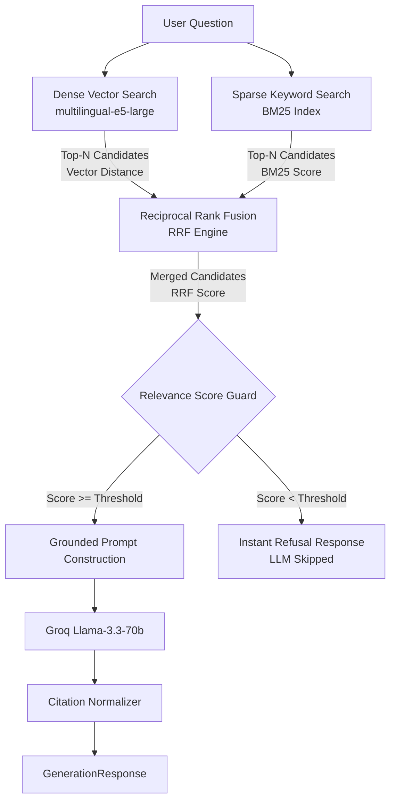

# Hybrid Retrieval & RRF Pipeline Documentation

## Architecture & Overview

The hybrid retrieval engine combines dense semantic vector search with sparse keyword search (BM25) and rank fusion (RRF).

---

## Component Details

### 1. Vector Search (`backend/app/rag/vector_store.py`)
- **Embedding Model**: `intfloat/multilingual-e5-large` (1024-dimensional dense vectors).
- **Distance Metric**: Cosine similarity (`hnsw:space: cosine`).
- **Vector DB**: ChromaDB running persistent storage at `./chroma_db`.

### 2. BM25 Search (`backend/app/rag/bm25_index.py`)
- **Tokenizer**: Custom whitespace/lowercase regex tokenizer preserving English text and Tamil Unicode characters (`\w+`).
- **Persistence**: Saved to `./chroma_db/bm25_index.json` with lazy initialization on first search query.

### 3. Reciprocal Rank Fusion (`backend/app/rag/retrieval_service.py`)
RRF aggregates rankings from vector search and BM25 search without needing score normalization across different scales:

$$RRF\_Score(d) = \sum_{m \in M} \frac{1}{k + r_m(d)}$$

Where:
- $M = \{\text{Vector Search}, \text{BM25 Search}\}$
- $k = 60$ (standard rank smoothing constant)
- $r_m(d)$ is the 1-based rank position of document $d$ in method $m$.

### 4. Relevance Guard & Threshold Check
Before invoking the LLM, the retrieval service verifies candidate relevance:
1. `top_rrf_score >= settings.retrieval_min_score` (default `0.015`)
2. Vector distance check (`vector_score <= settings.retrieval_max_vector_distance`) OR BM25 score check (`bm25_score >= settings.retrieval_min_bm25_score`).

If relevance checks fail, the system returns `_NO_RELEVANT_INFO` directly with `llm_called = False`.
